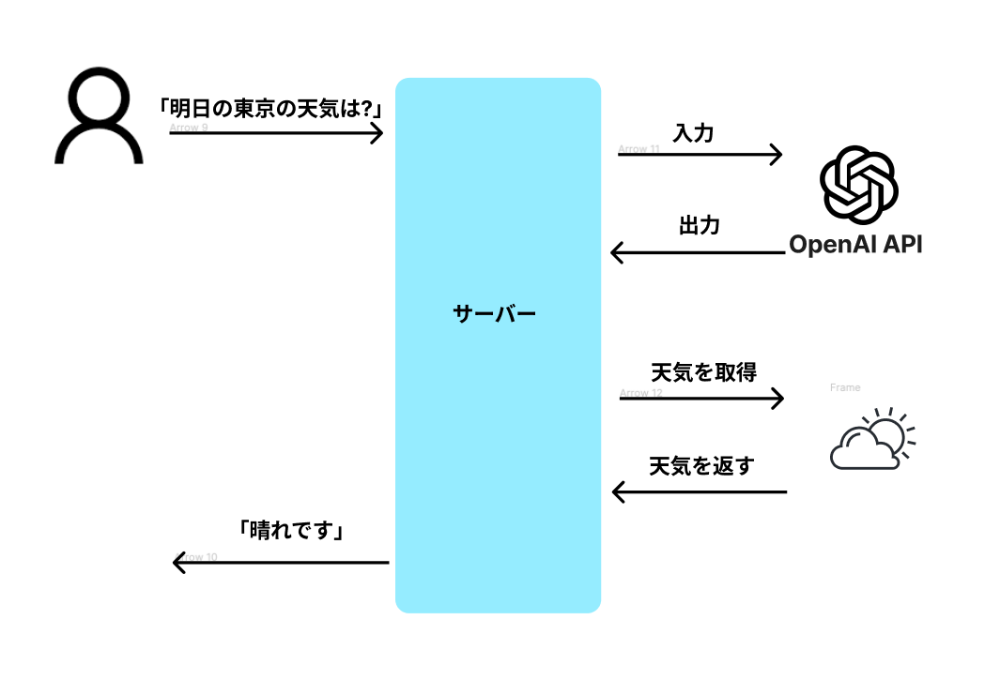
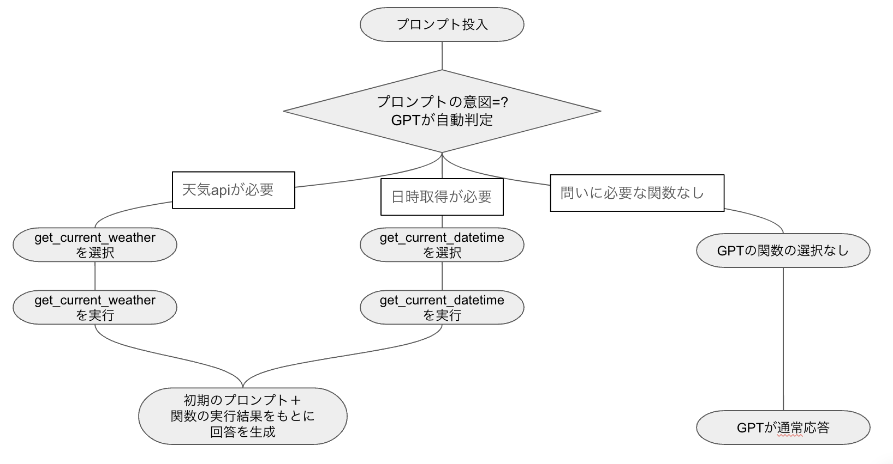
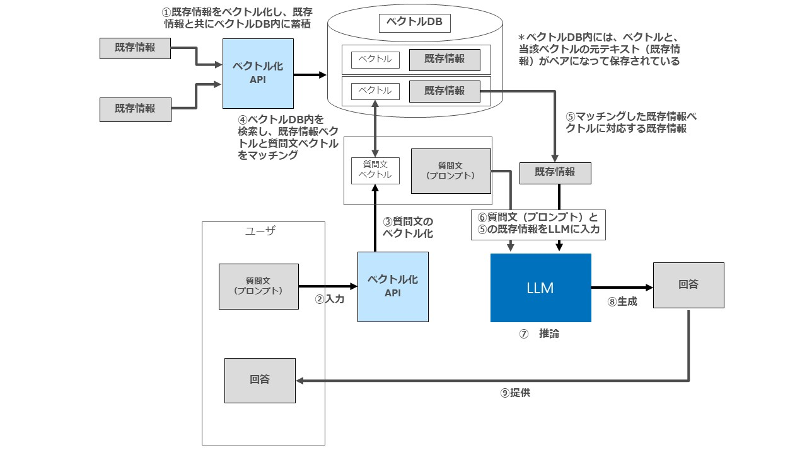
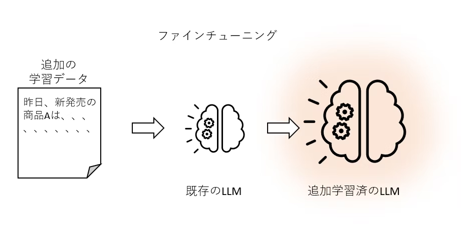
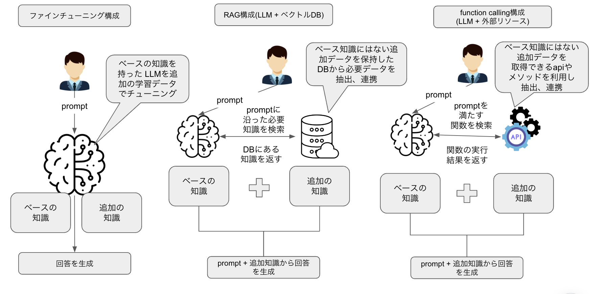
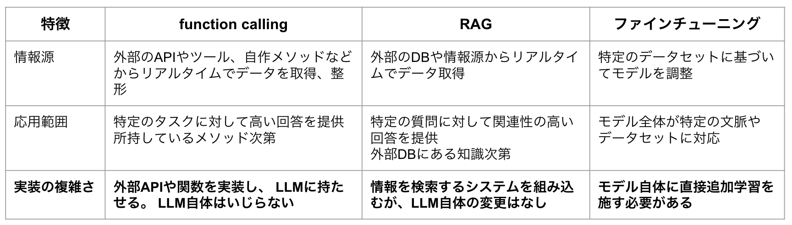

# LLM-study

# function calling
事前に定義した関数を必要に応じて呼び出し、関数の実行結果を元に回答を生成させるもの。

ユーザの質問から文章を解析して必要な関数を呼び出して、必要情報を付加して解答を生成する

イメージとしてはこんな感じ([引用](https://zenn.dev/kazuwombat/articles/1f39f003298028))

## 処理の流れ
以下の流れで処理が行われます。

    1. 関数定義
    2. プロンプトと関数の送信（（AIが）質問に必要な関数を選び、引数を作成する）
        - ユーザのプロンプトと同時に作成した関数のリストをAPIに送信
    3. モデルの判断
        - モデルで学習された内容のみで解答を作成するか、関数を使うべきかを判断する
    4. 関数の実行（（プログラムが）関数を実行）
        - もし、関数を実行すべきと判断した場合は、関数を実行するための引数を辞書型のデータで返す。そのデータをもとにクライアント側で関数を実行して、その結果を返す
    5. 関数の出力結果に基づく応答　（（AIが）関数結果も入力に入れて質問に回答する）
        - 関数の実行結果を加えて、最終的な解答を生成して、ユーザに返す

- 補足
    - 4の時点での関数実行結果を5に使わなければいけないわけではない。例えば、4の結果をもとに別の処理を走らせるなどしてもOKらしい→その結果をさらに2回目の回答情報に追加することもできるかも？

### ざっくりイメージ

## メリット、デメリット
- メリット
    - 外部のデータベースにアクセス結果をもとに回答できるようになる
    - OpenAIと外部のシステム連携をミスなく正確に行うことができるようになります。(この機能ができるまでは安定していなかった、プロンプトエンジニアリングによる調整が必要だった)

## function callingの種類

### 旧式のfunction calling
1つのリクエストに対して、一つの関数を利用するかしないかを判定して、function callingを行う([参考](https://www.tdi.co.jp/miso/openai-function-calling-gpt))

### Parallel function calling (並列実行)
1つのリクエストに対して、複数の関数を選択、実行してレスポンスを生成してくれる　← こちらが主流になりつつある。

toolsという引数が増え、今後のアップデートも期待できそう（[参考](https://book.st-hakky.com/data-science/open-ai-parallel-function-calling/)）

# RAG(Retrieval-Augmented Generation)
RAG（Retrieval-Augmented Generation）システムは、LLM（Large Language Model）と呼ばれる大規模言語モデルと、Retrieval（文書検索モデル）を組み合わせた、質問応答（QA）を行うための自然言語処理（NLP）システムの一種です。その主な機能は、大量の情報源から必要な情報を取り出し、その情報に基づいて回答を生成することです。
RAGはファインチューニングとは異なり、 LLMのパラメータを調整するわけではなく、 LLMの入力するデータの内容を調整する手法で、プロンプトエンジニアリングに含まれるもの

### ざっくりイメージ([引用](https://storialaw.jp/blog/9916))

## 流れ

1. UserがLLMに質問
2. LLMが知識DB（外部DBに情報を検索）（質問をベクトル化、回答を自然言語処理 etc…）
3. 知識DBから回答に関係ありそうな情報を抽出
4.  LLMが検索結果と質問を元に回答を生成
5. Userに回答を返す

## メリット、デメリット
- メリット
    -  LLMが処理できるデータは訓練データの中だけですが、RAGを用いることでリアルタイムで外部の情報源にアクセスし、より正確で豊富な回答を生成することが可能になる。

## 精度を上げるためには？
- Embeddingモデルの活用（ベクトル使うやつです）
- チャンクサイズの調整（どのくらいのテキスト量ごとにベクトル化を行うか、粒度的なもの）
    - 大きくすると、外さないけど、大雑把な回答が返ってくる
        
        小さくすると、外す確率が上がるが、正確な解答が期待できる
        
        ここは入力するデータとよしなに相談
- 精度を上げるための8ステップ([参考](https://fintan.jp/page/10301/))

# ファインチューニング
公開されているLLMモデルに対して、独自のデータを追加で学習させ、新たな知識を蓄えたモデルを作り出す技術([参考](https://qiita.com/ksonoda/items/b9fd3e709aeae79629ff))。

### 　ざっくりイメージ([引用](https://qiita.com/ksonoda/items/b9fd3e709aeae79629ff))

## ファインチューニングのユースケース([引用](https://zenn.dev/nano_sudo/articles/eaf0d77646d7b8))
- 適するユースケース
    - ビジネス向けのチャットbot
    - キャラクター性を持った会話bot
    - ある操作に特化したAIアシスタント
    - 出力の信頼性が重要なユースケース
- 適さないユースケース
    - 知識ベースの質問応答
    - GPT-4で十分な性能が得られる場合
    - RAGや関数呼び出しで十分な性能が得られる場合

## メリット、デメリット
- メリット
## ファインチューニング時の懸念点
- 壊滅的忘却が発生するリスクがある
    - モデルのパラメータが新しい概念やタスクを学習する過程で、事前学習時に獲得した一般的な言語知識を失う壊滅的忘却と呼ばれる事象が発生する可能性がある
    - 壊滅的忘却が起こることで、意図しないモデルの汎用性や転移性能の低下が発生することにつながる
- 学習データが少ない場合にオーバーフィットしやすい
    - 新たなタスクの適用のために用意できるデータが少ない中で全てのパラメータを更新した場合には過学習(オーバーフィット)が起こる可能性が高く、タスク固有の知識に依存してしまう可能性がある
- モデルサイズが大きく管理運用コストが大きい
    - 異なるタスクに対してFull FTを行うたびに、モデルのパラメータを保存するために多くのストレージスペースが必要
    - また、モデルのサイズも大規模であるためモデルの管理や共有が困難
    - モデルのサイズが大きくなるにつれて、計算コストやメモリコストが増大し、実行が困難になる
    - 例えば、GPT-3は1750億パラメータを持っているため膨大な時間とリソースが必要であり大規模な計算リソースを有している企業や団体でなければそもそも実行が不可能

## いろいろなファインチューニング手法
- FFT(full-model fine-tuning/Full Parameter Fine-Tuning) ← これが一番メジャーな手法な気がする

    事前学習済みのモデルのパラメータも含めてフルでチューニングする。

    近年は、LLMがかなり大きくなってきたため、フルパラメータチューニングはコストがかかる。

- PEFT(Parameter-Efficient Fine-Tuning)([引用](https://blog.brainpad.co.jp/entry/2023/05/22/153000))
    
    一部のパラメータだけをファインチューニングするアプローチ

    LLMのような事前学習済みモデルを、新しいタスクに効率的に適応させるための手法です。モデルの全体ではなく、一部のパラメータだけをファインチューニングすることで、Full FTの持つ問題を解決できる手法として注目を集めています。
 
- RLHF(強化学習) ([引用](https://note.com/npaka/n/nff4091ea33ce))
    - AIモデルの出力に「人間の価値基準（人間の好み）」が反映されるための学習プロセス
    - 手順
        1. 事前学習モデルを教師あり学習でファインチューニング
        2. 報酬モデルの学習
        3. 教師あり学習でファインチューニングをしたモデルを強化学習でさらにファインチューニング

# 3つの違い
図と表で表すとこんな感じになると思われる

- ファインチューニングは、モデル自体をアップデートする形
- RAGとfunction callingは一時的にモデルに対して知識の追加をおこなって回答をさせる形。プロンプトエンジニアリングの上位互換的な役割？

# LangChain
 ### Agent機能
「言語モデルに渡されたツールを用いて、モデル自体が次にどのようなアクションを取るかを決定、実行、観測し、完了するまで繰り返す機能」([参考](https://zenn.dev/umi_mori/books/prompt-engineer/viewer/langchain_agents))

「ユーザーに何か要求されたら、自分の知識と与えられた Tool を使って出来る限り回答する。」 という動きになっています。([参考](https://www.ogis-ri.co.jp/otc/hiroba/technical/similar-document-search/part29.html))

### LangGraph

